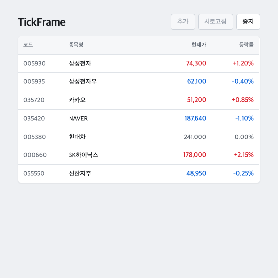
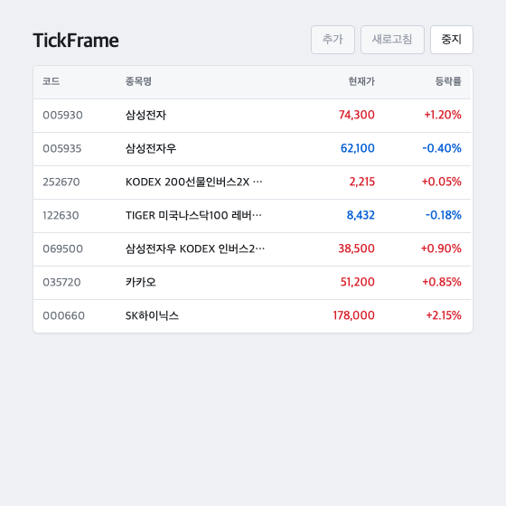

# TickFrame

<p align="center">
  <strong>관심종목 보드. 열 계약은 JSON으로 고정하고, 시세는 JS 바인딩으로만 붙입니다.</strong>
</p>

<p align="center">
  
  
  
  
</p>

TickFrame은 증권 MTS 관심종목 화면을 **화면 계약 + 틱 바인딩**으로 재현한 웹 보드입니다. 시안 종목명은 8글자인데 실제 데이터는 40자까지 있습니다. 이름이 현재가 열을 밀면 등락 숫자의 x가 행마다 달라집니다. 이 프로젝트는 그 밀림을 계약으로 막습니다.

로그인, 주문, 차트, 웹소켓, 실거래소는 없습니다. HTTP polling과 목 시세만 있습니다.

> [!NOTE]
> Flutter 앱이 아닙니다. 화면 JSON 계약과 JavaScript 바인딩만 다룹니다.

## Why TickFrame?

| 문제 | 흔한 처리 | TickFrame |
| --- | --- | --- |
| 긴 종목명이 숫자 열을 민다 | flex/auto width | `column-contract.json`에 px, align, overflow 고정 |
| 부분 틱이 필드를 비운다 | 패킷으로 행을 통째 교체 | merge patch. 없는 필드는 유지, `null`만 비움 |
| 호가 단위와 다른 소수 | 원본 price를 그대로 그림 | `roundToTick(price, tickSize)` 이후 값만 DOM에 넣음 |
| 지연 패킷이 최신 값을 덮는다 | 도착 순서로 반영 | `bindTicker` generation으로 늦은 응답 폐기 |

## Lucy Studio Front 업무 대응

| Lucy Studio Front | TickFrame |
| --- | --- |
| Figma 시안을 화면으로 옮김 | Figma 열 프레임을 `contracts/column-contract.json`으로 옮김 |
| JS로 API, 이벤트, 상태를 붙임 | `bindTicker`가 시세 JSON을 행 상태에 붙임 |
| 재사용 컴포넌트 | `TickerTable` / `TickerRow`. 열은 계약으로 그림 |
| 디자이너와 검수 | 긴 종목명 fixture로 열 x좌표를 시안과 비교 |
| 일반 Flutter 앱이 아님 | Flutter 앱을 만들지 않음. 화면 계약과 JS 바인딩만 |

## Features

- **열 계약** — 코드 92px, 종목명 176px ellipsis, 현재가/등락 오른쪽 정렬. 행 높이 36px
- **부분 틱 merge** — price만 와도 등락 열이 비지 않음
- **호가 반올림** — tickSize 100 종목은 100 단위만 표시. 등락 색은 `displayPrice`로만 계산
- **지연 패킷 폐기** — 구 generation 응답은 적용하지 않음
- **화면 상태** — idle / refreshing / error. 에러여도 마지막 표시값 유지
- **첫 틱 전 skeleton** — 이후 부분 틱이 와도 skeleton으로 돌아가지 않음

## 화면

한 페이지입니다. 열은 `코드`, `종목명`, `현재가`, `등락률` 네 개입니다.

- idle: 새로고침 가능. 행은 마지막 표시값
- refreshing: 중지 버튼만 활성. 추가는 항상 비활성 (CRUD는 MVP에 없음)
- error: 마지막 표시값 유지. 에러 텍스트는 헤더

짧은 이름:



긴 이름 (ellipsis, 현재가 열 x는 그대로):



## Quick Start

```bash
npm install
npm test
npm run dev
```

브라우저에서 새로고침을 누르면 `GET /ticks`를 polling합니다. 중지를 누르면 멈춥니다.

## How it works

```
WatchlistScreen  ──ports──►  loadWatchlist / bindTicker
       │
  TickerTable / TickerRow     presentation. fetch 없음
       │
  applyPatchToRow             domain. merge + roundToTick
       │
  http tick feed + mock       infrastructure. 지연 패킷 폐기
```

화면은 포트만 받습니다. 도메인은 Vite와 `fetch`를 모릅니다. `src/app`이 HTTP 구현을 화면에 연결합니다.

```
contracts/column-contract.json   열 너비·정렬·overflow
contracts/instruments.json       종목 마스터, tickSize
contracts/watchlist.json         보드 코드. 긴 이름 fixture 포함
src/pages/watchlist/             화면, 테이블, 행, 새로고침 바
src/entities/ticker/             merge, roundToTick, 열 계약
src/features/watchlist-refresh/  카탈로그 로드, bindTicker 유스케이스
src/shared/api/                  HTTP, 지연 패킷 폐기, 목 서버
src/app/                         composition
```

## Mock API

`src/shared/api/mock-server.ts`가 `fetch`를 가로챕니다.

| 경로 | 역할 |
| --- | --- |
| `GET /instruments` | 종목 마스터. tickSize 포함 |
| `GET /watchlist` | 보드 코드 목록. 40자 이름 3개 포함 |
| `GET /ticks?codes=` | 부분 필드 시세. 약 40%는 price만, 20%는 changePct만, 40%는 전체. 지연 0.3–2초. 구 패킷이 신 패킷 뒤에 올 수 있음 |

## Tests

```bash
npm test
```

Vitest + Testing Library + jsdom.

통과 기준:

- 긴 종목명 행과 짧은 행의 현재가 열 x가 1px 이내
- 부분 틱 100회 동안 등락 열이 비지 않음
- tickSize 100 종목의 표시가가 100 단위
- 행 높이 분산 0

행이 많아져도 이 프로젝트의 성과는 열 x와 부분 틱입니다. 마운트 수는 성과가 아닙니다.

## Stack

React 19, TypeScript, Vite 6, Vitest, Testing Library, HTML, CSS, JSON
